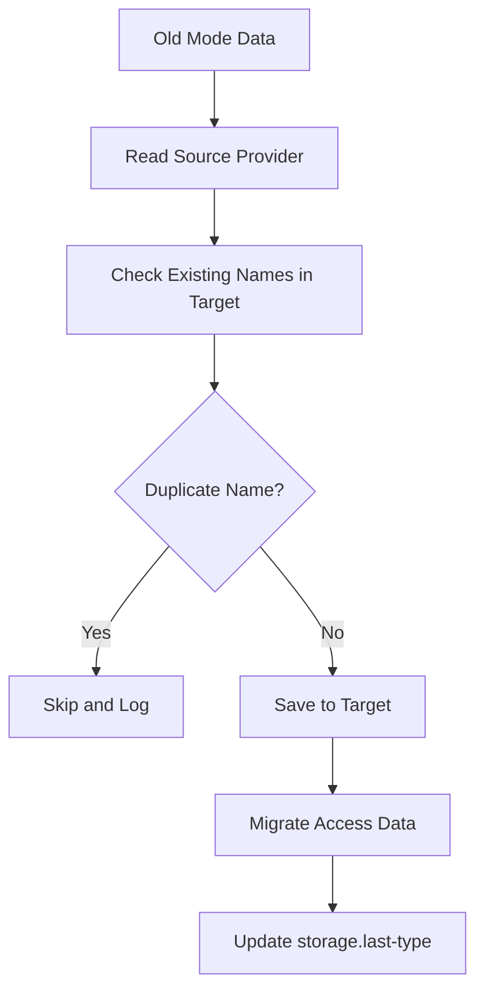

# PixelWarp Guide

Complete setup and operations guide for PixelWarp on Paper 1.21.1+.

## Contents

- Requirements
- Installation
- First Boot Checklist
- Configuration Reference
- Storage Modes
- Commands
- Permissions and Access Rules
- Cooldown Behavior
- Reload and Failsafe
- Backup and Migration
- Build From Source
- Troubleshooting

## Requirements

| Component | Version |
|---|---|
| Paper | 1.21.1+ |
| Java | 21+ |
| MySQL | 5.7+ or 8.0+ (if MYSQL mode is used) |

## Installation

1. Build or download the plugin jar.
2. Place jar in server plugins folder.
3. Start server once to generate default config.
4. Stop server and edit plugins/PixelWarp/config.yml.
5. Start server again.

## First Boot Checklist

- Set storage.type to FILE or MYSQL.
- Configure server-owners UUID list.
- Configure admins list if needed.
- If FILE encryption is enabled, set your own secret key.
- Confirm warp.create-delete-cooldown-seconds value.

## Configuration Reference

Path: plugins/PixelWarp/config.yml

```yaml
config-version: 1

storage:
  type: FILE
  last-type: FILE

mysql:
  host: localhost
  port: 3306
  database: pixelwarp
  username: root
  password: "password"
  pool-size: 5

file:
  path: plugins/PixelWarp/data/
  encryption: true
  secret-key: "change-this-to-16-char-key"
  compression: false

server-owners:
  - "00000000-0000-0000-0000-000000000000"

admins: []

warp:
  create-delete-cooldown-seconds: 5

teleport:
  countdown-seconds: 2
  safe-check: true

preview:
  duration-seconds: 10

particles:
  enabled: true
  radius: 12
  max-per-warp: 3
  interval-ticks: 40
  dynamic: true

  # Advanced engine options (optional)
  engine:
    enabled: true
    intensity: 1.0
    radius: 32
    interval-ticks: 40
    index-refresh-ticks: 40
    max-height-diff: 24
    max-warps-per-player: 4
    patterns:
      ring: true
      spiral: true
      pulse: true
```

## Storage Modes

### FILE Mode (Default)

- Stores data in warps.dat
- Supports AES encryption
- Supports optional compression
- Has backup restore flow
- Can enter read-only failsafe on unrecoverable write/read error

### MYSQL Mode

- Uses MySQL-backed warp and access data
- Maintains existing schema compatibility
- Async operations with provider abstraction

### Migration Behavior

- Switching storage mode triggers migration.
- Duplicate warp names are skipped, not overwritten.
- Access data is migrated with safety checks.



## Commands

### Player Commands

| Command | Purpose |
|---|---|
| /setwarp <name> [category] [public|private] | Create warp |
| /delwarp <name> [confirm] | Delete warp with confirmation flow |
| /warp <name> | Teleport to warp |
| /warp help | Show major command guide |
| /warp info | Show plugin info, storage mode, total warps |
| /warp version | Show plugin version |
| /warps | Open warp GUI |
| /warp preview <name> | Preview warp location |
| /warp stats <name> | Show warp details |
| /warp top | Top used warps |
| /warp edit <name> <location|category|public|private> | Edit warp |
| /warp rename <old> <new> | Rename warp |
| /warp access <add|remove|list> <warp> [player] | Manage private access |

### Admin/Owner Commands

| Command | Purpose |
|---|---|
| /warp debug | Health report |
| /warp reload [config|storage|all] | Runtime reload |
| /pwarp reload [config|storage|all] | Same reload via admin alias |
| /warp backup confirm | Manual file backup |
| /warp export | Export warps to JSON |
| /warp import [file] | Import warps from JSON |

## Permissions and Access Rules

- Server owners are loaded from server-owners.
- Global admins are loaded from admins.
- Non-owner players can manage only their own warps.
- Private warp access is controlled by warp access list.

## Cooldown Behavior

Shared cooldown applies between create and delete actions.

- Key: warp.create-delete-cooldown-seconds
- Default: 5
- Scope: per player
- Applies to: successful /setwarp and /delwarp actions
- Set value to 0 to disable this cooldown

## Particle Behavior

Particle system is tuned for visual quality with low server impact.

- `>12 blocks`: no particles rendered
- `5-12 blocks`: idle ring animation using END_ROD
- `<5 blocks`: focus spiral animation using PORTAL
- Per-warp particle points are capped to `2-3` depending on distance
- Task interval defaults to `40` ticks

Teleport arrival uses a one-time firework-style burst effect.

## Reload and Failsafe

### Reload

Reload command uses guarded runtime flow:

- /warp reload config
- /warp reload storage
- /warp reload all

It blocks conflicting operations while reload runs and returns status message at completion.

### Read-only Failsafe

If storage enters an unsafe state, write operations are blocked.

- Create/update/delete/import operations are blocked
- Read operations remain available
- Health report shows failsafe reason

## Backup and Migration

### Manual backup

Use /warp backup confirm for immediate backup in FILE mode.

### Export and import

- /warp export writes JSON backup
- /warp import reads backup and merges safely
- Existing warp names are skipped

## Build From Source

Windows PowerShell:

```powershell
.\gradlew.bat build
```

Output:

- build/libs

## Troubleshooting

### Plugin starts in read-only mode

- Check console for storage reason.
- Verify file path permissions.
- If encryption enabled, verify secret key length is 16, 24, or 32 bytes.

### Warps not loading

- Check world names in stored data.
- Missing worlds are skipped by design.

### MySQL connection failure

- Recheck mysql host, port, user, password, database.
- Ensure database server is reachable from game host.

### Reload command denied

- Ensure sender is server owner or admin.

## Maintainer and Repository

- Repository: https://github.com/PGGAMER9911/PixelWarp.git
- Username: PGGAMER9911
- Email: gamitparth04@gmail.com
