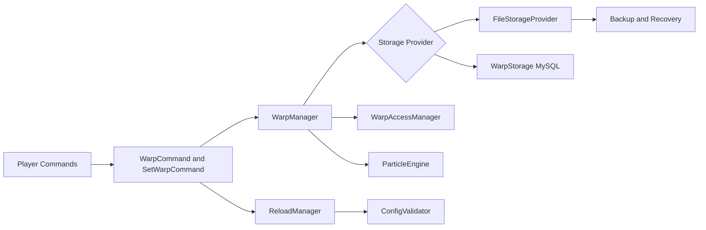
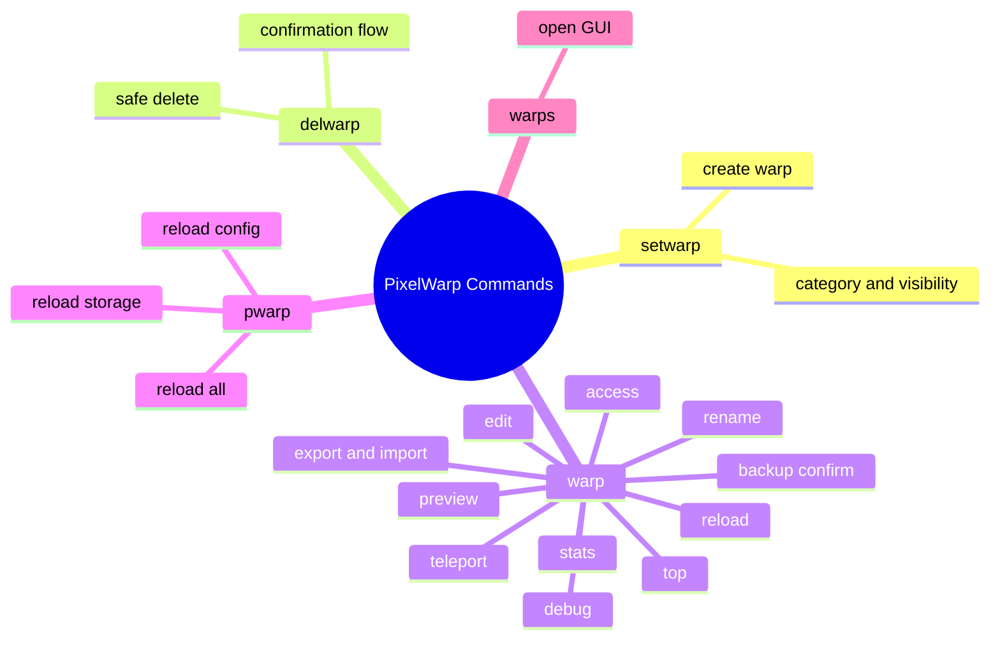

# PixelWarp

Advanced, production-ready warp plugin for Paper servers with dual storage (FILE + MySQL), access control, preview mode, runtime reload, backups, and modular particle animations.

[](https://papermc.io)
[](https://adoptium.net)
[](#storage-modes)
[](LICENSE)

## Why PixelWarp

PixelWarp is built for SMP servers that need reliability under real load:

- Fast warp access with in-memory indexing
- Safe persistence with FILE/MySQL provider model
- Read-only failsafe if storage health is compromised
- Runtime reload controls without full restart
- Clean admin tools and health report output

## Visual Overview



## Feature Highlights

### Core Warp System

- Create warp: /setwarp <name> [category] [public|private]
- Delete warp with confirmation: /delwarp <name> [confirm]
- Shared create/delete cooldown from config
- Edit, rename, visibility updates

### Access and Administration

- Private warp sharing: /warp access add/remove/list
- Global admins and server owners
- Runtime reload: /warp reload [config|storage|all]
- Shortcut command: /pwarp reload [config|storage|all]

### Safety and Data Integrity

- FILE mode with optional AES encryption
- Optional FILE compression support
- Backup and restore fallback path
- Manual backup command: /warp backup confirm
- Migration safety with duplicate-skip behavior
- Read-only failsafe when persistence risk is detected

### Player Experience

- GUI browsing: /warps
- Warp preview mode
- Top and stats commands
- Modular particle engine with category styles

## Command Map



## Storage Modes

| Mode | Default | Notes |
|---|---|---|
| FILE | Yes | Supports encryption, compression, backup restore, failsafe |
| MYSQL | Optional | Uses existing schema and async operations |

## Quick Start

1. Build plugin jar via Gradle.
2. Put jar in plugins folder.
3. Start server once to generate config.
4. Set storage settings and owner/admin UUIDs.
5. Restart server.

## Important Config Keys

```yaml
storage:
  type: FILE

warp:
  create-delete-cooldown-seconds: 5

file:
  path: plugins/PixelWarp/data/
  encryption: true
  secret-key: "change-this-to-16-char-key"
  compression: false
```

See full configuration and operational guide in [GUIDE.md](GUIDE.md).

## Build From Source

Windows PowerShell:

```powershell
.\gradlew.bat build
```

Jar output:

- build/libs/

## Project Layout

- src/main/java/com/pixelwarp
- src/main/resources/config.yml
- src/main/resources/plugin.yml
- GUIDE.md

## Repository

- GitHub: https://github.com/PGGAMER9911/PixelWarp.git

## Maintainer

- Username: PGGAMER9911
- Email: gamitparth04@gmail.com

## Notes

For production servers, keep regular backups and test config changes on staging before live rollout.
